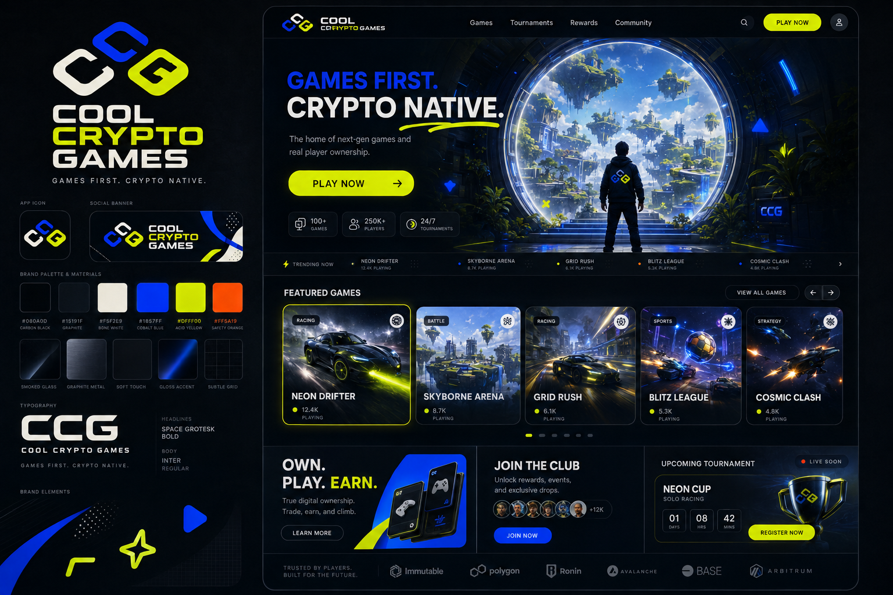
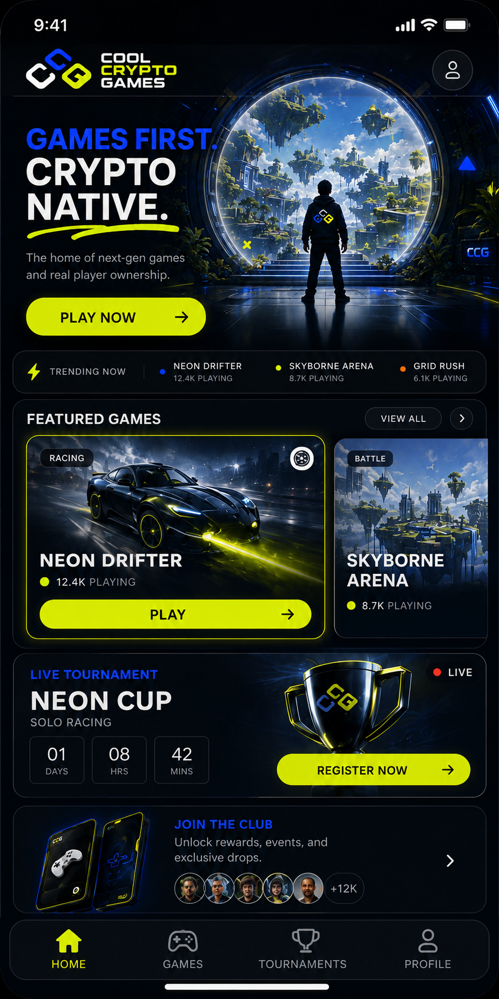

FOUNDING PRODUCT BIBLE

**COOL CRYPTO GAMES**

Games first. Crypto native.

| **NORTH STAR Build the game platform WEBCADE was reaching for: excellent games, fair developer economics, trusted competition, live community, and optional crypto infrastructure that never gets in the way of fun.** |
|------------------------------------------------------------------------------------------------------------------------------------------------------------------------------------------------------------------------|

Version 0.1 \| September 4, 2026 \| Founding working draft

This document defines the intended product and operating model. Legal,
tax, payments, privacy, promotion, and gaming counsel must review
implementation before launch.

CONTENTS

# The CCG operating system

01 North star and positioning

02 Player experience

03 Wallet-gated play and security

04 Game catalog and quality bar

05 Developer platform and economics

06 CCG revenue engine

07 Tournaments, prizes and competitive integrity

08 Live streams and community

09 Product map and functional requirements

10 Technical architecture

11 Trust, safety and legal-risk boundaries

12 Launch strategy and first five games

13 Roadmap

14 Metrics and operating cadence

15 Non-negotiables and first 30 days

Appendix A CCG game SDK contract

Appendix B Launch readiness checklist

Appendix C Sources and policy references

## Executive decision

CCG will launch as a curated, web-first gaming network. Anybody can
browse the catalog, watch streams, inspect leaderboards, discover
developers, and view tournament schedules without a wallet. A wallet
connection and free message signature are required only when a player
starts a game, submits a score, enters a tournament, or claims a prize.

| **POSITIONING Browse freely. Watch freely. Connect to play. Never pay to play.** |
|----------------------------------------------------------------------------------|

CCG is not a crypto casino, a token launchpad, an uncurated upload
portal, or a collection of shallow promotional games. It is a place
where people come because the games are worth playing. Wallets provide
persistent identity and security. Money flows toward developers,
production, prizes, and the platform - not toward player-funded
wagering.

01

# North star and positioning

A total gamer paradise must earn that description through the quality
and density of the experience. The home page should feel alive: games
launching, tournaments counting down, creators streaming, players
climbing leaderboards, new updates arriving, and developers visibly
earning from successful work.

## Mission

Make internet-native games easier to discover, more rewarding to build,
and more exciting to compete in.

## Brand promise

| **Audience**   | **CCG promise**                                                                                       |
|----------------|-------------------------------------------------------------------------------------------------------|
| **Players**    | Instant fun, trusted competition, meaningful identity, and prizes without pay-to-win mechanics.       |
| **Developers** | Distribution, monetization, analytics, community, tournament infrastructure, and transparent payouts. |
| **Sponsors**   | Brand-safe access to engaged gaming communities and measurable event activations.                     |
| **CCG**        | A durable platform business built on revenue share, memberships, sponsorships, and services.          |

## Positioning sentence

Cool Crypto Games is a curated browser gaming network where players
connect a wallet to play, developers earn from the audiences they build,
and free-entry skill tournaments turn great games into live events.

## Experience principles

- Games are the product. Crypto is infrastructure.

- The first playable moment matters more than the first purchase.

- Every economic rule must be understandable in one screen.

- Competition is verified, observable, and appealable.

- Developers can see how revenue is calculated.

- Mobile is a primary platform, not a reduced desktop layout.

- CCG launches fewer games and makes each one matter.

## Brand system

The visual identity combines a dark graphite product shell with
bone-white surfaces, cobalt structural accents, acid-yellow action
states, and rare safety-orange alerts. The interface is sleek and
gamer-forward without retro nostalgia, casino imagery, market charts, or
excessive cyberpunk effects.

| **Role**       | **Specification**   | **Usage**                                                |
|----------------|---------------------|----------------------------------------------------------|
| **Foundation** | \#080A0D / \#15191F | Navigation, page shell, game theater, streaming surfaces |
| **Primary**    | \#1857FF cobalt     | Links, selected states, navigation, developer identity   |
| **Action**     | \#DFFF00 acid       | Play, register, live status, verified result             |
| **Surface**    | \#F5F2E9 bone       | Readable contrast, editorial cards, announcements        |
| **Alert**      | \#FF5A19 orange     | Limited events, warnings, expiring states                |

02

# Player experience

CCG should turn discovery into play with as little ceremony as possible.
A visitor can understand the platform, inspect games, watch broadcasts,
and explore community activity before connecting anything. The wallet
gate appears only at the moment of play and clearly explains why it
exists.

## Core player loop

1.  Discover a game through the home feed, creator page, live event,
    > friend activity, or tournament.

2.  Open a rich game page and understand the fantasy, controls, session
    > length, and competitive mode.

3.  Tap Play, connect a supported wallet, and sign a free authentication
    > message.

4.  Play immediately inside a focused game theater.

5.  Receive a verified result, XP, achievements, progression, and
    > leaderboard movement.

6.  Follow the game or developer, share a clip or scorecard, and enter
    > the next relevant event.

## Access rules

| **Activity**                     | **Wallet** | **Account/session rule**                               |
|----------------------------------|------------|--------------------------------------------------------|
| **Browse games and developers**  | No         | Public                                                 |
| **Watch streams and clips**      | No         | Public; chat may require account                       |
| **View leaderboards and events** | No         | Public                                                 |
| **Play any game**                | Required   | Signature creates verified play session                |
| **Submit score or achievement**  | Required   | Bound to active wallet session                         |
| **Enter tournament**             | Required   | Eligibility and rules acceptance required              |
| **Claim prize**                  | Required   | Same wallet plus additional verification when required |

## Mobile-first home

Direction reference: compact hero, thumb-sized play action, swipeable
game cards, live tournament module, and persistent bottom navigation.

## Required primary navigation

- Home - personalized discovery and live activity

- Games - curated catalog and filters

- Tournaments - current, upcoming, and completed events

- Live - official broadcasts and approved creator streams

- Developers - studios, updates, and follow graph

- Profile - identity, achievements, history, rewards, and settings

## Game page anatomy

| **Zone**           | **Required content**                                                      |
|--------------------|---------------------------------------------------------------------------|
| **Above the fold** | Title, key art, Play, live status, players online, tournament status      |
| **Game theater**   | Responsive runtime, controls, fullscreen, performance and report controls |
| **Competition**    | Leaderboards, verified badges, current events, personal best              |
| **Creator**        | Developer identity, follow, updates, support and revenue-bearing items    |
| **Community**      | Approved streams, clips, reviews, friends playing and report tools        |

03

# Wallet-gated play and security

| **LOCKED RULE A wallet is required to play. It is an authentication and accountability requirement, not a payment requirement.** |
|----------------------------------------------------------------------------------------------------------------------------------|

## Wallet connection requirements

- Any supported, valid wallet can play, including an empty wallet.

- No token holding, balance, NFT, transaction, gas payment, approval, or
  asset permission is required.

- The user signs a human-readable authentication message containing
  domain, nonce, issued time, expiration, and requested capability.

- The signed message is verified server-side before a session is issued.

- The wallet is never asked to sign every input, frame, or round.

- The interface explains that signing does not create a blockchain
  transaction or grant access to assets.

## Secure play-session flow

1.  Play request: client requests a one-time nonce from CCG.

2.  Wallet proof: wallet signs the scoped authentication message.

3.  Risk evaluation: service evaluates wallet, device, IP/network, rate
    > limits, history, and active sanctions.

4.  Authorization: server issues a short-lived, game-specific play token
    > bound to wallet, device risk state, game version, and match ID.

5.  Game launch: isolated runtime receives only the minimum scoped token
    > it needs.

6.  Telemetry: game records required input and event evidence during the
    > run.

7.  Result submission: backend validates token, chronology, score model,
    > replay evidence, and duplicate state.

8.  Decision: result becomes verified, held for review, or rejected with
    > an auditable reason code.

## Security model

| **Layer**                 | **Purpose**                                 | **Important limitation**                                |
|---------------------------|---------------------------------------------|---------------------------------------------------------|
| **Wallet signature**      | Cryptographic control of player identity    | Wallets are inexpensive to create; not sufficient alone |
| **Device risk**           | Detect repeat abuse and automation clusters | Probabilistic; shared devices exist                     |
| **IP/network risk**       | Rate limits and anomaly context             | Never use IP alone for permanent bans                   |
| **Server match ID**       | Stops replay and duplicate submissions      | Requires strict expiration and single-use rules         |
| **Event/replay evidence** | Supports score verification and appeals     | Collection must be proportionate and disclosed          |
| **Manual review**         | Protects high-value finals                  | Needs trained reviewers and consistent procedures       |

## Tournament integrity controls

- Delayed publication for suspicious top scores

- Server-authoritative logic where technically feasible

- Deterministic replays or compact input logs

- Impossible-state and velocity checks

- Wallet, device, and behavior graphing

- Rate limits and cool-downs

- Manual verification for finalists

- Appeal window and documented reviewer decision

## Privacy boundary

Security signals should be used to protect games, not to create an
undisclosed surveillance product. Publish the categories of data
collected, retention periods, decision uses, appeal path, and deletion
controls. Hash or minimize identifiers where possible. Do not promise
that the system is unbeatable; promise that high-value results are
verified through layered evidence.

04

# Game catalog and quality bar

CCG begins as a curated platform. Open submissions may be accepted for
review, but nothing is published automatically. The catalog should feel
edited, alive, and intentional.

## Founding catalog shape

| **Slot**                 | **Purpose**                     | **Required strength**                                    |
|--------------------------|---------------------------------|----------------------------------------------------------|
| **Flagship competition** | Creates the identity of CCG     | Deep mastery, spectator clarity, fair scoring            |
| **Instant score chase**  | Fast repeat sessions            | Under 10 seconds to understand; strong one-more-run loop |
| **PvP duel**             | Social rivalry and live events  | Short matches, stable networking, readable outcomes      |
| **Progression game**     | Longer retention                | Meaningful unlocks without pay-to-win                    |
| **External standout**    | Proves developer platform value | Distinct voice and creator-led community                 |

## Release gates

- Originality and intellectual-property attestation

- Stable launch on target mobile and desktop browsers

- Defined performance budget and loading target

- Touch, keyboard, and controller behavior where applicable

- Responsive game theater and safe-area support

- Save and resume behavior

- Crash, error, and telemetry instrumentation

- Clear controls and onboarding

- Tournament-compatible deterministic rules when applicable

- Age/content rating and moderation classification

- No undisclosed wallet actions or external transaction prompts

## Catalog tiers

| **Tier**     | **Meaning**                      | **Visibility**                                 |
|--------------|----------------------------------|------------------------------------------------|
| **Featured** | CCG-certified flagship quality   | Home, campaigns, tournaments, live programming |
| **Arcade**   | Released and supported           | Catalog, search, recommendations               |
| **Labs**     | Early access with visible status | Opt-in discovery; feedback tools               |
| **Archived** | No longer actively supported     | Profile history and direct links; no promotion |

## What CCG rejects

- Reskins created only to promote a token

- Broken or unfinished prototypes presented as releases

- Copied characters, maps, audio, branding, or mechanics presented
  deceptively

- Casino-first experiences or disguised wagering

- Games that require external purchases to be competitive

- Games whose primary loop is watching advertisements

- Apps that request wallet permissions unrelated to play authentication

05

# Developer platform and economics

Developers should experience CCG as a distribution, monetization,
competition, and community partner. The platform earns trust through
clear contracts, fast payouts, usable analytics, human support, and
public economic rules.

## CCG Developer Studio

- Game upload, versioning, staged rollout, rollback, and release notes

- SDK configuration for wallet identity, sessions, saves, scores,
  achievements, purchases, and telemetry

- Device and browser compatibility reporting

- Store items, cosmetics, season content, and pricing controls

- Tournament creation proposals and event operations

- Revenue ledger showing gross receipts, deductions, net receipts,
  split, and payout status

- Retention, funnel, session, crash, purchase, and tournament analytics

- Community updates, stream scheduling, clips, reviews, and moderation
  queue

## Recommended economic rules

| **Revenue source**                 | **Developer share** | **CCG share** | **Basis**                                                      |
|------------------------------------|---------------------|---------------|----------------------------------------------------------------|
| **Game cosmetics / passes**        | 80%                 | 20%           | Net receipts attributable to the game                          |
| **Advertising in game**            | 70%                 | 30%           | Net advertising receipts                                       |
| **Direct player support**          | 90%                 | 10%           | Net receipts after payment costs                               |
| **CCG-sourced sponsor activation** | 70%                 | 30%           | Net campaign revenue after approved direct costs               |
| **CCG membership**                 | 50% pool            | 50%           | Net subscription revenue; pool allocated by quality engagement |

All contracts must define net receipts plainly: money actually received
minus disclosed taxes, payment processing, refunds, chargebacks, and
agreed direct campaign costs. CCG should publish a worked example and
never change a split retroactively.

## Founding Developers Program

Recruit a small founding class and give them white-glove support.
Recommended offer: enhanced launch placement, direct integration help,
co-produced tournament, founder badge, featured stream, and an
introductory 90/10 game-revenue split for a defined period. In exchange,
founding developers commit to quality milestones, telemetry, update
cadence, player support, and promotional participation.

## Developer rights

- Developer retains ownership of the game and pre-existing IP.

- CCG receives only the distribution and promotion licenses required by
  the agreement.

- Developer can inspect revenue calculations and export performance
  data.

- Removal, suspension, chargeback, moderation, and dispute procedures
  are documented.

- Exclusivity is optional, narrow, compensated, and time-limited.

06

# CCG revenue engine

The platform should make money because it improves distribution,
payments, events, community, and production. It should not make money
from players losing wagers.

## Revenue pillars

| **Pillar**             | **Player value**                                                            | **CCG value**                               |
|------------------------|-----------------------------------------------------------------------------|---------------------------------------------|
| **Membership**         | Ad-free experience, cloud benefits, identity customization, early playtests | Recurring revenue                           |
| **Game commerce**      | Cosmetics, expansions, season content                                       | Revenue share                               |
| **Sponsorships**       | Bigger events, prizes, broadcasts, limited cosmetics                        | Campaign and production margin              |
| **Advertising**        | Free access when used with restraint                                        | Scaled catalog monetization                 |
| **Developer services** | Optional QA, porting, live ops, art, analytics                              | Service revenue without tax on all creators |

## Membership boundaries

A membership may provide ad-free browsing, profile themes, cloud saves,
private lobbies, early playtests, expanded social features, and non-cash
XP boosts. It must not improve prize odds, buy tournament placement,
provide extra attempts in a prize event, or create a gameplay advantage
in competitive modes.

## Sponsor package anatomy

- Named event or season with clear sponsor labeling

- Fixed prize commitment held before promotion

- Developer production allocation

- CCG broadcast and operations allocation

- Optional non-pay-to-win cosmetic integration

- Stream overlays and approved placements

- Performance report covering reach, qualified players, playtime, stream
  viewers, and conversion

## Commerce rules

- No dark patterns, hidden recurring charges, or fake scarcity.

- Prices and developer shares are visible before purchase.

- Competitive power is never sold.

- Refund and chargeback behavior is defined.

- Sponsored placements are labeled.

- Randomized paid rewards are excluded from the founding product.

07

# Tournaments, prizes and competitive integrity

| **FOUNDING FORMAT Free entry. Predetermined sponsor- or platform-funded prizes. Objective skill. Published rules. Verified results.** |
|---------------------------------------------------------------------------------------------------------------------------------------|

## Event types

| **Format**               | **Best use**                      | **Result model**                                  |
|--------------------------|-----------------------------------|---------------------------------------------------|
| **Open leaderboard**     | Broad weekly participation        | Highest verified score during event window        |
| **Qualifier + final**    | High-value featured event         | Open qualifying followed by live verified final   |
| **Head-to-head bracket** | PvP games and broadcasts          | Match result advances player                      |
| **Developer challenge**  | Launch or update activation       | Game-specific objective and judging/scoring rules |
| **Community cup**        | Teams, clubs, partner communities | Aggregate verified performance                    |

## Required official-rule fields

- Sponsor and administrator

- Eligibility, age, and geography

- No-purchase entry statement

- Opening and closing timestamps

- Game version and permitted devices

- Scoring method and tie-breakers

- Prohibited conduct and anti-cheat evidence

- Prize description and approximate retail value

- Winner verification, notification, taxes, and claim deadline

- Disqualification and appeal process

- Publicity and data-use terms

- Platform-store disclaimer where applicable

## Prize policy

CCG should begin with physical gaming gear, sponsor products,
merchandise, gift cards, travel support where appropriate, and fixed
cash prizes administered through compliant payout processes. Token
prizes, tradable prize tickets, and onchain prize pools should wait for
jurisdiction-specific review.

## Hard prohibitions

- Player-funded prize pools or peer-to-peer wagers

- Paid entry or purchased tournament attempts

- Purchased items that affect score or odds

- Stake-to-enter or deposit-to-compete

- Random winner selection inside a paid gameplay loop

- Changing rules after an event begins

- Publishing unverified high-value results as final

## Competition operations

Every material event needs an event owner, rules owner, integrity
reviewer, support path, incident channel, prize ledger, final
verification record, and post-event report. High-value finals should be
streamed when practical and use enhanced verification.

08

# Live streams and community

Live programming is the heartbeat that turns a catalog into a
destination. CCG should not attempt to replicate a universal streaming
platform at launch. It should produce and curate streams that make its
games and developers matter.

## Launch programming

- Weekly CCG tournament broadcast

- Developer launch premiere and Q&A

- Verified high-score attempts

- Speedrun and challenge nights

- Patch preview and playtest streams

- Community cups and creator exhibitions

## Streaming rollout

| **Phase**        | **Capability**                                          | **Moderation level**                             |
|------------------|---------------------------------------------------------|--------------------------------------------------|
| **1 - Curated**  | Official channel plus approved embedded creators        | Pre-approved accounts; monitored chat            |
| **2 - Partner**  | Developer and verified creator channels                 | Identity, reporting, filtering, human escalation |
| **3 - Platform** | Broader native streaming, clips, subscriptions and tips | Full trust-and-safety operation                  |

## Community architecture

- Follow games, developers, players, clubs, and tournaments

- Activity feed built around scores, releases, streams, events, and
  achievements

- Comments or chat only where moderation coverage exists

- Clips live on the related game page rather than in an unrelated
  content feed

- Block, mute, report, appeal, and enforcement-history tools

- Verified developer and tournament-official identities

## Creator monetization

Approved streamers can earn through direct support, channel membership,
sponsorship activations, affiliate game commerce, and event production
fees. CCG should publish creator splits and prohibit misleading prize,
token, or investment claims.

09

# Product map and functional requirements

| **Surface**          | **Primary job**             | **MVP requirements**                                                    |
|----------------------|-----------------------------|-------------------------------------------------------------------------|
| **Home**             | Convert attention into play | Hero, trending, featured games, live event, tournaments, updates        |
| **Games**            | Catalog discovery           | Categories, filters, search, compatibility, sort, editorial collections |
| **Game page**        | Play and deepen engagement  | Theater, wallet gate, details, leaderboards, creator, streams, store    |
| **Tournaments**      | Organize competition        | Schedule, rules, eligibility, entry, standings, results, history        |
| **Live**             | Create appointment viewing  | Featured stream, schedule, approved channels, clips                     |
| **Developers**       | Build creator identity      | Studio pages, games, updates, streams, follows, support                 |
| **Profile**          | Represent player history    | Wallet, achievements, scores, follows, cosmetics, privacy               |
| **Developer Studio** | Publish and earn            | Builds, SDK, analytics, commerce, payouts, events, support              |
| **Admin**            | Operate trust and quality   | Review queues, sanctions, prize ledger, moderation, releases, incidents |

## Homepage hierarchy

1.  Live or timely platform story

2.  Immediate Play action

3.  Featured games

4.  Trending now

5.  Active tournament

6.  Live stream

7.  New and updated games

8.  Developer spotlight

9.  Community activity

## Search and discovery signals

Recommendations should balance explicit follows, device compatibility,
genres, recent play, friend activity, editorial curation, quality score,
update freshness, and verified retention. Paid placement must be labeled
and may not override minimum quality requirements.

## Accessibility and compatibility

- Keyboard navigation for the shell

- Visible focus states and semantic controls

- Captions for official video

- Color is never the only status indicator

- Reduced-motion support

- Controller and touch mapping disclosure

- Safe-area handling on mobile

- Performance profiles for lower-end devices

10

# Technical architecture

CCG should be web-first and installable as a progressive web app. The
platform shell and game runtimes are separate trust zones. Games receive
narrowly scoped capabilities through the CCG SDK rather than direct
access to platform sessions.

## Core services

| **Service**              | **Responsibility**                                                 | **MVP note**                        |
|--------------------------|--------------------------------------------------------------------|-------------------------------------|
| **Web application**      | Discovery, profiles, tournaments, streams, commerce                | Responsive server-rendered shell    |
| **Identity**             | Wallet challenge, signature verification, sessions, recovery links | No asset approvals                  |
| **Game runtime gateway** | Versioned game launch and isolation                                | Sandboxed origin / iframe policies  |
| **Game SDK API**         | Saves, scores, achievements, telemetry, commerce                   | Capability-scoped tokens            |
| **Competition service**  | Events, entries, rules, standings, verification                    | Immutable event version after start |
| **Integrity service**    | Risk signals, anomaly detection, replay review                     | Reason-coded decisions              |
| **Media service**        | Streams, VOD, clips, schedules                                     | Curated providers first             |
| **Commerce and payout**  | Orders, ledger, refunds, developer splits                          | Marketplace payment provider        |
| **Admin console**        | Moderation, publishing, sanctions, prizes, incidents               | Role-based access and audit log     |

## Isolation requirements

- Each game build runs on a separate restricted origin or equivalent
  isolated container.

- Game code cannot read platform cookies, wallet provider objects, or
  another game's storage.

- The shell passes only short-lived, audience-bound capabilities through
  an allow-listed message protocol.

- Network destinations and requested permissions are declared in the
  game manifest.

- Build files are scanned, hashed, versioned, and immutable after
  tournament start.

- Content Security Policy and cross-origin protections are treated as
  release gates.

## Reliability targets

| **Measure**                              | **Founding target**                                                     |
|------------------------------------------|-------------------------------------------------------------------------|
| **Shell availability**                   | 99.9% monthly target after public launch                                |
| **Crash-free game sessions**             | At least 99.0% per released title; higher for featured events           |
| **Median time from Play to interactive** | Under 5 seconds on supported broadband; game-specific budgets disclosed |
| **Score submission durability**          | Idempotent; no duplicate award on retry                                 |
| **Incident ownership**                   | Named on-call owner during promoted tournaments                         |

## Data model minimums

Wallet, user profile, consent record, device-risk pseudonym, game,
build, manifest, play session, match, event log, score, verification
decision, achievement, tournament, entry, standing, prize, order, ledger
line, developer account, revenue share, payout, stream, clip, report,
sanction, appeal, and audit event.

11

# Trust, safety and legal-risk boundaries

This section defines product constraints, not legal conclusions. Before
launch, qualified counsel must review the exact tournament, prize,
payment, privacy, intellectual-property, streaming, and age-access
implementation for every jurisdiction served.

## Required policy set

- Terms of Service

- Privacy Policy and state/country notices

- Cookie and tracking controls

- Developer Distribution Agreement

- Tournament and Prize Policy

- Official Rules template

- Community Standards

- Streaming and Creator Policy

- Acceptable Use Policy

- DMCA notice, designated agent, takedown, and repeat-infringer policy

- Refund Policy

- Security and vulnerability reporting policy

- Law-enforcement and data-request procedure

## Lower-risk founding boundaries

| **Area**        | **Founding position**                               | **Escalation trigger**                             |
|-----------------|-----------------------------------------------------|----------------------------------------------------|
| **Wallet**      | Authentication only; no payment or holding required | Token gating, staking, asset approvals             |
| **Competition** | Free entry and objective skill                      | Entry fees, paid attempts, chance                  |
| **Prizes**      | Fixed and sponsor/platform funded                   | Player-funded pools or tradable prize currency     |
| **Commerce**    | Cosmetics and content; no competitive power         | Cash-out, secondary-market promises                |
| **Crypto**      | Optional collectibles and supported payouts later   | Platform token, investment language                |
| **Streaming**   | Curated and moderated                               | Open broadcasting or anonymous chat                |
| **Age**         | 18+ founding account/competition policy             | Expansion to children or mixed-age social features |

## Moderation requirements

- Pre-publication game review

- Automated and human content filtering where applicable

- In-product reporting

- Blocking and muting

- Published contact channel

- Response-time targets by severity

- Transparent enforcement reasons

- Appeal path

- Evidence retention rules

- Emergency stream and chat shutdown controls

## Legal review gates

Counsel approval is required before introducing paid competition, random
prizes, token rewards, tradable assets tied to play, international prize
events, travel prizes, under-18 participation, open live streaming,
peer-to-peer transfers, custodial balances, or any marketing that
implies profit or investment return.

12

# Launch strategy and first five games

| **LAUNCH PHILOSOPHY Do not fill the site. Make five games feel like an entire world.** |
|----------------------------------------------------------------------------------------|

## Founding content slate

| **Game role**                     | **Session**          | **Launch programming**                      |
|-----------------------------------|----------------------|---------------------------------------------|
| **Flagship competitive original** | 3-8 minutes          | Launch championship and weekly ranked event |
| **Endless score chase**           | 30 seconds-3 minutes | Daily challenge and creator record attempts |
| **PvP duel**                      | 2-5 minutes          | Bracket nights and community rivalry        |
| **Progression title**             | 10-30 minutes        | Seasonal goals and developer streams        |
| **Founding indie partner**        | Varies               | Developer premiere and sponsored challenge  |

## Launch-week rhythm

| **Day**       | **Programming**                                                  |
|---------------|------------------------------------------------------------------|
| **Monday**    | Platform opening, founder message, five-game showcase            |
| **Tuesday**   | Developer spotlight and behind-the-scenes stream                 |
| **Wednesday** | Open qualifier begins                                            |
| **Thursday**  | Community challenge and clips                                    |
| **Friday**    | Live final and prize verification                                |
| **Weekend**   | Open play, featured creator streams, recap and next-event reveal |

## Founding developer acquisition

- Recruit directly rather than opening a public marketplace.

- Show the revenue contract and SDK before asking for exclusivity or
  integration work.

- Offer a funded polish milestone where budget allows.

- Give every launch developer a page, premiere, tournament, and
  measurable campaign.

- Publish developer success stories with real numbers only after
  permission.

## Go-to-market message

Lead with the games and the people making them. Avoid claims about
earning money as a player. The clean launch message is: "Five games. One
live competition network. Developers share in what they create. Connect
a wallet to play - no purchase required."

13

# Roadmap

| **Phase**               | **Outcome**                   | **Included**                                                           | **Explicitly excluded**           |
|-------------------------|-------------------------------|------------------------------------------------------------------------|-----------------------------------|
| **0 - Foundation**      | Rules and architecture locked | Brand, product bible, counsel review, SDK spec, founding slate         | Public launch                     |
| **1 - Closed alpha**    | End-to-end verified play      | Wallet auth, 2 games, scores, profiles, admin review                   | Prizes and open social            |
| **2 - Founding beta**   | Playable platform             | 5 games, catalog, tournaments, developer pages, official stream        | Open uploads and native streaming |
| **3 - Revenue launch**  | Developers and CCG earn       | Commerce, membership, sponsor operations, payout ledger                | Platform token                    |
| **4 - Creator network** | Community scales              | Approved channels, clips, clubs, richer social, developer self-service | Anonymous open broadcast          |
| **5 - Expansion**       | Platform distribution grows   | PWA maturity, selective native app, additional regions and genres      | Unreviewed real-money mechanics   |

## Suggested timing

A credible founding beta is likely a multi-month build, not a weekend
website. Timing depends heavily on whether the five games already exist,
how tournament-authoritative they are, and whether streaming is embedded
or native. Stage gates should be based on quality and integrity evidence
rather than calendar promises.

## Release gates by phase

- Foundation exit: economics, wallet gate, prize boundaries, policy
  owners, and architecture approved.

- Alpha exit: wallet signature, game isolation, score verification,
  telemetry, and admin review work end to end.

- Beta exit: five games meet quality bar; support and event operations
  are staffed.

- Revenue exit: ledger reconciles; refunds, chargebacks, developer
  statements, and payouts are tested.

- Creator exit: reporting, blocking, filtering, takedown, moderation,
  and appeals are operational.

14

# Metrics and operating cadence

## North-star metric

| **WEEKLY VERIFIED PLAYERS Unique wallets that complete at least one valid, human-quality game session during the week. This rejects empty traffic and keeps attention on actual play.** |
|-----------------------------------------------------------------------------------------------------------------------------------------------------------------------------------------|

## Player metrics

| **Metric**                          | **Why it matters**                                            |
|-------------------------------------|---------------------------------------------------------------|
| **Play conversion**                 | Percent of game-page visitors who connect and begin a session |
| **Time to interactive**             | Friction from Play tap to control                             |
| **D1 / D7 / D30 retention**         | Whether fun persists beyond prize events                      |
| **Sessions per verified player**    | Strength of the game loop                                     |
| **Organic vs. incentivized return** | Whether CCG survives without rewards                          |
| **Tournament repeat rate**          | Competition health                                            |

## Developer metrics

- Monthly active earning developers

- Median earnings per 1,000 verified play hours

- Time from approved build to release

- Payout accuracy and timeliness

- Developer retention

- Share of plays outside sponsored events

## Quality and integrity metrics

- Crash-free session rate

- P50 and P95 load time

- Held-score rate

- False-positive appeal rate

- Tournament incident rate

- Moderation response time

- Prize verification and payout time

## Operating cadence

| **Cadence**             | **Meeting / review**                                                  |
|-------------------------|-----------------------------------------------------------------------|
| **Daily during launch** | Reliability, fraud, support, event readiness                          |
| **Weekly**              | Game health, player retention, content calendar, developer pipeline   |
| **Per tournament**      | Rules sign-off, integrity readiness, live operations, postmortem      |
| **Monthly**             | Revenue reconciliation, developer statements, trust-and-safety trends |
| **Quarterly**           | Catalog strategy, economic splits, policy review, roadmap reset       |

15

# Non-negotiables and first 30 days

## CCG will always

- Require a wallet signature before game play.

- Allow empty wallets to play without a transaction.

- Prioritize game quality over catalog count.

- Publish tournament rules before entry opens.

- Separate purchased Credits, non-cash XP, and predetermined prizes.

- Show developers how earnings are calculated.

- Verify high-value competitive results.

- Label sponsorships and early-access games.

- Provide reporting, blocking, appeals, and human escalation where
  community content exists.

## CCG will not launch with

- A platform token

- Pay-to-play prize tournaments

- Player-funded prize pools

- Purchased score advantages

- Random paid rewards with real-world value

- Open anonymous streaming

- Unreviewed game uploads

- Promises that anti-cheat is impossible to defeat

- A catalog full of low-quality promotional reskins

## First 30 days

1.  Form the company and retain gaming/promotions, privacy, payments,
    > and IP counsel.

2.  Approve the founding economic model, wallet-auth message, prize
    > boundaries, and age/geography position.

3.  Define the first five game roles and select the first two alpha
    > titles.

4.  Write the CCG SDK specification and game manifest schema.

5.  Prototype the desktop and mobile shell around one real game runtime.

6.  Implement wallet signature, expiring play token, match ID, score
    > submission, and admin review.

7.  Draft the Developer Distribution Agreement and official
    > tournament-rules template.

8.  Recruit three to five founding developers and one launch sponsor
    > candidate.

9.  Run a closed internal tournament with no public prize and document
    > every failure.

10. Set the beta launch gate from evidence, not excitement.

| **DECISION FOR THE FOUNDER Build the smallest version that proves three things: players return for the games, developers trust the economics, and tournament results can be verified.** |
|-----------------------------------------------------------------------------------------------------------------------------------------------------------------------------------------|

APPENDIX A

# CCG game SDK contract

## Founding SDK capabilities

| **Capability**  | **Game can request**                             | **Game cannot access**                                   |
|-----------------|--------------------------------------------------|----------------------------------------------------------|
| **Identity**    | Scoped player ID and display profile             | Wallet keys, asset permissions, unrelated wallet history |
| **Session**     | Match ID, game/build version, expiration         | Platform cookies or other game sessions                  |
| **Save**        | Namespaced cloud state                           | Another title's save data                                |
| **Score**       | Submit typed result and evidence reference       | Write directly to public leaderboard                     |
| **Achievement** | Request unlock with evidence                     | Grant platform XP without validation                     |
| **Commerce**    | Display approved product and confirm entitlement | Initiate undisclosed wallet transaction                  |
| **Telemetry**   | Declared gameplay and performance events         | Undeclared cross-site tracking                           |

## Example manifest fields

- game_id and developer_id

- semantic version and immutable build hash

- supported viewport/orientation

- input methods and accessibility capabilities

- network allow-list

- requested SDK capabilities

- save schema version

- score schema and verification mode

- telemetry declaration

- content rating and regional restrictions

- privacy contact and support URL

## Message protocol

The initial protocol should cover ready, resize, pause, resume,
end-session, save, load, submit-score, achievement-request,
purchase-request, entitlement-query, telemetry-batch, and report-error.
Every message includes protocol version, game ID, session ID, timestamp,
request ID, and capability scope. The shell validates origin and schema
before processing.

## Build immutability

A tournament references an exact game build hash and rules version. Once
the event opens, neither changes. Emergency shutdown is allowed, but
silent replacement is not. If a material defect changes competitive
outcomes, the event owner follows the published cancellation, restart,
or remediation rule.

APPENDIX B

# Launch readiness checklist

## Product and games

- \[ \] Five-game slate approved

- \[ \] All releases pass performance and compatibility gates

- \[ \] Wallet-to-play disclosure is clear

- \[ \] Guest browsing and viewing work without wallet

- \[ \] Mobile safe areas and touch controls verified

- \[ \] Support and report paths visible

## Competition and prizes

- \[ \] Official rules approved

- \[ \] Prize inventory or funds committed

- \[ \] Eligibility and geography enforced

- \[ \] Anti-cheat and finalist review rehearsed

- \[ \] Appeal and support owners assigned

- \[ \] Prize claim and tax workflow tested

## Developer and commerce

- \[ \] Developer agreements executed

- \[ \] Revenue splits configured

- \[ \] Ledger reconciled against test transactions

- \[ \] Refund and chargeback paths tested

- \[ \] Payout onboarding complete

- \[ \] Sponsor placements labeled

## Trust, safety and operations

- \[ \] Policies published

- \[ \] DMCA agent and workflow established

- \[ \] Moderation queue staffed

- \[ \] Block/report/appeal tools tested

- \[ \] Incident runbook rehearsed

- \[ \] Backups and rollback verified

- \[ \] Privacy disclosures match actual collection

APPENDIX C

# Sources and policy references

These sources support the founding risk boundaries and should be
rechecked before launch because platform rules and regulatory
interpretations change.

**Apple App Review Guidelines  
**https://developer.apple.com/app-store/review/guidelines/  
Sections on creator content, user-generated content, payments, contests,
sweepstakes, and real-money gaming.

**Google Play Real-Money Gambling, Games, and Contests  
**https://support.google.com/googleplay/android-developer/answer/9877032?hl=en  
Restrictions on money, purchased items, contests, tournaments, loyalty
programs, and prizes.

**FTC: Fake Prize, Sweepstakes, and Lottery Scams  
**https://consumer.ftc.gov/articles/fake-prize-sweepstakes-and-lottery-scams  
Consumer-facing explanation that sweepstakes are free and purchases
cannot improve odds.

**FTC COPPA Compliance Plan  
**https://www.ftc.gov/business-guidance/resources/childrens-online-privacy-protection-rule-six-step-compliance-plan-your-business  
Requirements when covered services collect personal information from
children under 13.

**U.S. Copyright Office: Section 512  
**https://www.copyright.gov/512/  
DMCA safe-harbor conditions for qualifying online service providers.

**Stripe Connect documentation  
**https://docs.stripe.com/connect  
Marketplace payments and connected-account payouts.

## Open founder decisions

- Company entity and launch jurisdictions

- Exact domain and public brand lockup

- Supported wallets at alpha

- Founding age policy and verification vendor

- First five games and ownership status

- Launch prize budget and sponsor target

- Membership price and benefits

- Developer payout countries and methods

- Streaming provider and moderation staffing

- Data retention and device-risk implementation

END OF FOUNDING PRODUCT BIBLE \| VERSION 0.1
